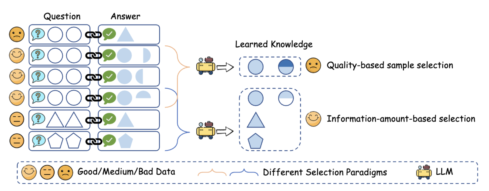

# ZIP



This code is a mindspore implementation of Entropy Law which is available at https://github.com/USTC-StarTeam/ZIP/blob/main/.

This is the project for the paper [Entropy Law: The Story Behind Data Compression and LLM Performance](https://arxiv.org/abs/2407.06645).


## Quick start

The formatter.py script standardizes the downloaded datasets into a unified JSON format, while script.sh provides the execution workflow.

### Data pool

The data pool used in the paper can be found in [here](https://huggingface.co/datasets/AndrewZeng/deita_sota_pool), which is provided by the [DEITA](https://github.com/hkust-nlp/deita). And we appreciate their contribution. If you want to use ZIP to select your data, we only currently support the following sharegpt format:

```json
[
    {
        "id": 0,
        "conversations":[
            {
                "from": "human",
                "value": "XXX",
            },
            {
                "from": "gpt",
                "value": "XXX",
            }
        ],
        "source": "ShareGPT"
    },
    {
        "id": 1,
        "conversations":[
            {
                "from": "human",
                "value": "XXX",
            },
            {
                "from": "gpt",
                "value": "XXX",
            }
        ],
        "source": "ShareGPT"
    }
]
```
### Perform data selection

```shell
python ZIP.py --data_path data_pool.json --save_path selected_data.json --budget 10000 
```
or just use the script
```shell
chmod +x script.sh
./script.sh
```

### LLM alignment & evaluation

- We use [Axolotl](https://github.com/axolotl-ai-cloud/axolotl) to align LLMs with the selected data.
- Then we use MT-bench in [FastChat](https://github.com/lm-sys/FastChat) to evaluate the aligned LLMs.

## Citation
If you find the content of this project helpful, please cite our paper as follows:
```
@ARTICLE{2024arXiv240706645Y,
       author = {{Yin}, Mingjia and {Wu}, Chuhan and {Wang}, Yufei and {Wang}, Hao and {Guo}, Wei and {Wang}, Yasheng and {Liu}, Yong and {Tang}, Ruiming and {Lian}, Defu and {Chen}, Enhong},
        title = "{Entropy Law: The Story Behind Data Compression and LLM Performance}",
      journal = {arXiv e-prints},
     keywords = {Computer Science - Machine Learning, Computer Science - Computation and Language},
         year = 2024,
        month = jul,
          doi = {10.48550/arXiv.2407.06645},
       eprint = {2407.06645},
}
```