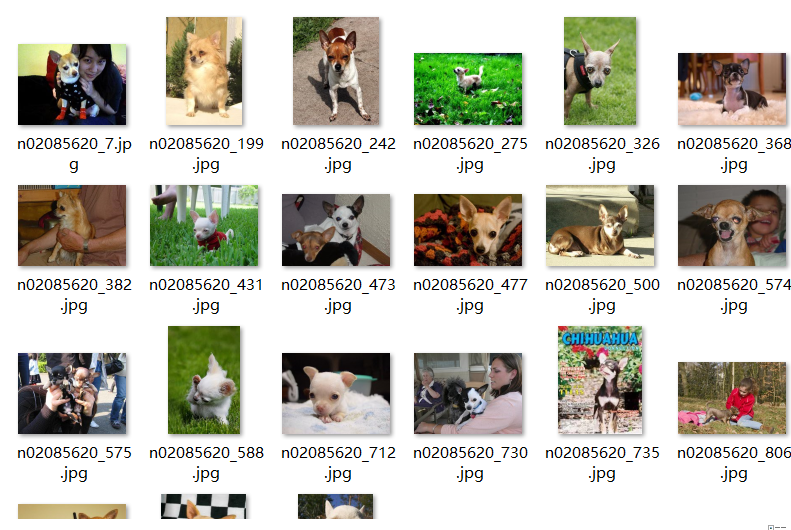
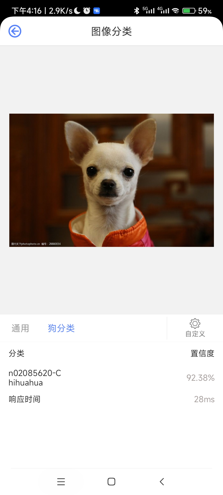

# 基于“狗和牛角包”神经网络的狗狗品种分类

***

## 数据准备

我们在网上下载了120个种类的狗狗数据集




数据集目录结构如下：

```
Dog
    ├── infer
    │   ├── chihuahua.jpg
    │   └── Bloodhood.jpg
    ├── Images
    │   ├── 120种类狗的图片
```

在这里我们没有将数据集提前分好类，而是将他们都放到一个目录 datesets\Dog\train 下。

---

### 加载数据集

导入需要的库

```python
import numpy as np
import mindspore.dataset as ds
import mindspore.dataset.vision.c_transforms as transforms
import mindspore

path = '.\datesets\Dog\train\train'

#读取文件夹内所有文件名放到dirs中
import os							
_, dirs, _ = next(os.walk(path))
class_num = 120
dirs = dirs[:class_num]
dirs.sort()
```

```
print(dirs)

['n02085620-Chihuahua', 'n02085782-Japanese_spaniel', 'n02085936-Maltese_dog', 'n02086079-Pekinese', 'n02086240-Shih-Tzu', 'n02086646-Blenheim_spaniel', 'n02086910-papillon', 'n02087046-toy_terrier', 'n02087394-Rhodesian_ridgeback', 'n02088094-Afghan_hound', 'n02088238-basset', 'n02088364-beagle', 'n02088466-bloodhound', 'n02088632-bluetick', 'n02089078-black-and-tan_coonhound', 'n02089867-Walker_hound', 'n02089973-English_foxhound', 'n02090379-redbone', 'n02090622-borzoi', 'n02090721-Irish_wolfhound', 'n02091032-Italian_greyhound', 'n02091134-whippet', 'n02091244-Ibizan_hound', 'n02091467-Norwegian_elkhound', 'n02091635-otterhound', 'n02091831-Saluki', 'n02092002-Scottish_deerhound', 'n02092339-Weimaraner', 'n02093256-Staffordshire_bullterrier', 'n02093428-American_Staffordshire_terrier', 'n02093647-Bedlington_terrier', 'n02093754-Border_terrier', 'n02093859-Kerry_blue_terrier', 'n02093991-Irish_terrier', 'n02094114-Norfolk_terrier', 'n02094258-Norwich_terrier', 'n02094433-Yorkshire_terrier', 'n02095314-wire-haired_fox_terrier', 'n02095570-Lakeland_terrier', 'n02095889-Sealyham_terrier', 'n02096051-Airedale', 'n02096177-cairn', 'n02096294-Australian_terrier', 'n02096437-Dandie_Dinmont', 'n02096585-Boston_bull', 'n02097047-miniature_schnauzer', 'n02097130-giant_schnauzer', 'n02097209-standard_schnauzer', 'n02097298-Scotch_terrier', 'n02097474-Tibetan_terrier', 'n02097658-silky_terrier', 'n02098105-soft-coated_wheaten_terrier', 'n02098286-West_Highland_white_terrier', 'n02098413-Lhasa', 'n02099267-flat-coated_retriever', 'n02099429-curly-coated_retriever', 'n02099601-golden_retriever', 'n02099712-Labrador_retriever', 'n02099849-Chesapeake_Bay_retriever', 'n02100236-German_short-haired_pointer', 'n02100583-vizsla', 'n02100735-English_setter', 'n02100877-Irish_setter', 'n02101006-Gordon_setter', 'n02101388-Brittany_spaniel', 'n02101556-clumber', 'n02102040-English_springer', 'n02102177-Welsh_springer_spaniel', 'n02102318-cocker_spaniel', 'n02102480-Sussex_spaniel', 'n02102973-Irish_water_spaniel', 'n02104029-kuvasz', 'n02104365-schipperke', 'n02105056-groenendael', 'n02105162-malinois', 'n02105251-briard', 'n02105412-kelpie', 'n02105505-komondor', 'n02105641-Old_English_sheepdog', 'n02105855-Shetland_sheepdog', 'n02106030-collie', 'n02106166-Border_collie', 'n02106382-Bouvier_des_Flandres', 'n02106550-Rottweiler', 'n02106662-German_shepherd', 'n02107142-Doberman', 'n02107312-miniature_pinscher', 'n02107574-Greater_Swiss_Mountain_dog', 'n02107683-Bernese_mountain_dog', 'n02107908-Appenzeller', 'n02108000-EntleBucher', 'n02108089-boxer', 'n02108422-bull_mastiff', 'n02108551-Tibetan_mastiff', 'n02108915-French_bulldog', 'n02109047-Great_Dane', 'n02109525-Saint_Bernard', 'n02109961-Eskimo_dog', 'n02110063-malamute', 'n02110185-Siberian_husky', 'n02110627-affenpinscher', 'n02110806-basenji', 'n02110958-pug', 'n02111129-Leonberg', 'n02111277-Newfoundland', 'n02111500-Great_Pyrenees', 'n02111889-Samoyed', 'n02112018-Pomeranian', 'n02112137-chow', 'n02112350-keeshond', 'n02112706-Brabancon_griffon', 'n02113023-Pembroke', 'n02113186-Cardigan', 'n02113624-toy_poodle', 'n02113712-miniature_poodle', 'n02113799-standard_poodle', 'n02113978-Mexican_hairless', 'n02115641-dingo', 'n02115913-dhole']
```

定义 `create_dataset`函数加载**狗狗分类**数据集，对数据集进行图像增强操作并设置数据集batch_size大小。

```python
def create_dataset(path, batch_size=16, train=True, image_size=224):
    dataset = ds.ImageFolderDataset(path, num_parallel_workers=8, class_indexing={dirs[x]:x for x in range(len(dirs))})
    
    # 图像增强操作
    mean = [0.485 * 255, 0.456 * 255, 0.406 * 255]
    std = [0.229 * 255, 0.224 * 255, 0.225 * 255]
    if train:
        trans = [
            transforms.RandomCropDecodeResize(image_size, scale=(0.08, 1.0), ratio=(0.75, 1.333)),
            transforms.RandomHorizontalFlip(prob=0.5),
            transforms.Normalize(mean=mean, std=std),
            transforms.HWC2CHW()
        ]
    else:
        trans = [
            transforms.Decode(),
            transforms.Resize(256),
            transforms.CenterCrop(image_size),
            transforms.Normalize(mean=mean, std=std),
            transforms.HWC2CHW()
        ]

    dataset = dataset.map(operations=trans, input_columns="image", num_parallel_workers=8)
    # 设置batch_size的大小，若最后一次抓取的样本数小于batch_size，则丢弃
    dataset = dataset.batch(batch_size, drop_remainder=True)
    
    return dataset.split([0.9,0.1])

dataset_train, dataset_val = create_dataset(path, train=False)
```

在返回数据时做一个切割，这样就同时准备好了训练集和测试集

```python
	return dataset.split([0.9,0.1])
dataset_train, dataset_val = create_dataset(path, train=False)
```

---

## 模型训练

### MobileNet V2模型原理

MobileNet网络是由Google团队于2017年提出的专注于移动端、嵌入式或IoT设备的轻量级CNN网络，相比于传统的卷积神经网络，MobileNet网络使用深度可分离卷积（Depthwise Separable Convolution）的思想在准确率小幅度降低的前提下，大大减小了模型参数与运算量。并引入宽度系数 αα 和分辨率系数 ββ 使模型满足不同应用场景的需求。

由于MobileNet网络中Relu激活函数处理低维特征信息时会存在大量的丢失，所以MobileNetV2网络提出使用倒残差结构（Inverted residual block）和Linear Bottlenecks来设计网络，以提高模型的准确率，且优化后的模型更小。


图中Inverted residual block结构是先使用1x1卷积进行升维，然后使用3x3的DepthWise卷积，最后使用1x1的卷积进行降维，与Residual block结构相反。Residual block是先使用1x1的卷积进行降维，然后使用3x3的卷积，最后使用1x1的卷积进行升维。

### MobileNet V2模型微调

使用MobileNet V2的预训练模型进行微调，通过删除MobileNet V2预训练模型中最后一个用于分类的1x1的卷积层的参数，使用**狗狗分类**数据集对模型进行重新训练。

```python
import mindspore.nn as nn
from mindspore.train import Model
from mindspore import load_checkpoint, load_param_into_net

from mindvision.classification.models import mobilenet_v2
from mindvision.engine.loss import CrossEntropySmooth

# 创建模型,其中目标分类数为120，图像输入大小为(224,224)
network = mobilenet_v2(num_classes=120, resize=224)

# 模型参数存入到param_dict
param_dict = load_checkpoint("./mobilenet_v2_1.0_224.ckpt")

# 获取mobilenet_v2网络最后一个卷积层的参数名
filter_list = [x.name for x in network.head.classifier.get_parameters()]

# 删除预训练模型的最后一个卷积层
def filter_ckpt_parameter(origin_dict, param_filter):
    for key in list(origin_dict.keys()):
        for name in param_filter:
            if name in key:
                print("Delete parameter from checkpoint: ", key)
                del origin_dict[key]
                break

filter_ckpt_parameter(param_dict, filter_list)

# 加载预训练模型参数作为网络初始化权重
load_param_into_net(network, param_dict)

# 定义优化器
network_opt = nn.Momentum(params=network.trainable_params(), learning_rate=0.01, momentum=0.9)

# 定义损失函数
network_loss = CrossEntropySmooth(sparse=True, reduction="mean", smooth_factor=0.1, classes_num=2)

# 定义评价指标
metrics = {"Accuracy": nn.Accuracy()}

# 初始化模型
model = Model(network, loss_fn=network_loss, optimizer=network_opt, metrics=metrics)

from mindvision.engine.callback import ValAccMonitor
from mindspore.train.callback import TimeMonitor

num_epochs = 10

# 模型训练与验证，训练完成后保存验证精度最高的ckpt文件（best.ckpt）到当前目录下
model.train(num_epochs,
            dataset_train,
            callbacks=[ValAccMonitor(model, dataset_val, num_epochs), TimeMonitor()])
```

```
Delete parameter from checkpoint:  head.classifier.weight
Delete parameter from checkpoint:  head.classifier.bias
Delete parameter from checkpoint:  moments.head.classifier.weight
Delete parameter from checkpoint:  moments.head.classifier.bias
--------------------
Epoch: [  1 /  10], Train Loss: [0.875], Accuracy:  0.938
epoch time: 119745.592 ms, per step time: 1273.889 ms
--------------------
Epoch: [  2 /  10], Train Loss: [0.784], Accuracy:  0.988
epoch time: 106371.512 ms, per step time: 1131.612 ms
--------------------
Epoch: [  3 /  10], Train Loss: [0.721], Accuracy:  0.994
epoch time: 102378.850 ms, per step time: 1089.137 ms
--------------------
Epoch: [  4 /  10], Train Loss: [0.661], Accuracy:  0.994
epoch time: 105478.180 ms, per step time: 1122.108 ms
--------------------
Epoch: [  5 /  10], Train Loss: [0.643], Accuracy:  0.994
epoch time: 105546.445 ms, per step time: 1122.835 ms
--------------------
Epoch: [  6 /  10], Train Loss: [0.599], Accuracy:  1.000
epoch time: 127915.052 ms, per step time: 1360.798 ms
--------------------
Epoch: [  7 /  10], Train Loss: [0.835], Accuracy:  0.994
epoch time: 114049.586 ms, per step time: 1213.293 ms
--------------------
Epoch: [  8 /  10], Train Loss: [0.588], Accuracy:  0.994
epoch time: 122475.141 ms, per step time: 1302.927 ms
--------------------
Epoch: [  9 /  10], Train Loss: [0.585], Accuracy:  1.000
epoch time: 130027.857 ms, per step time: 1383.275 ms
--------------------
Epoch: [ 10 /  10], Train Loss: [0.596], Accuracy:  1.000
epoch time: 109795.691 ms, per step time: 1168.039 ms
================================================================================
End of validation the best Accuracy is:  1.000, save the best ckpt file in ./best.ckpt
```

### 可视化模型预测

定义 `visualize_model` 函数，使用上述验证精度最高的模型对输入图像进行预测，并将预测结果可视化。

```python
import matplotlib.pyplot as plt
import numpy as np
from PIL import Image

from mindspore import Tensor

def visualize_model(path):
    image = Image.open(path).convert("RGB")
    image = image.resize((224, 224))
    plt.imshow(image)
# 归一化处理
memoryviewan = np.array([0.485 * 255, 0.456 * 255, 0.406 * 255])
std = np.array([0.229 * 255, 0.224 * 255, 0.225 * 255])
image = np.array(image)
image = (image - mean) / std
image = image.astype(np.float32)

# 图像通道由(h, w, c)转换为(c, h, w)
image = np.transpose(image, (2, 0, 1))

# 扩展数据维数为(1, c, h, w)
image = np.expand_dims(image, axis=0)

# 定义并加载网络
net = mobilenet_v2(num_classes=120, resize=224)
param_dict = load_checkpoint("./best.ckpt")
load_param_into_net(net, param_dict)
model = Model(net)

# 模型预测
pre = model.predict(Tensor(image))
result = np.argmax(pre)

print(pre)
print(result)
softmax=ops.Softmax(-1)
print(softmax(pre))

class_name = {x:dirs[x] for x in range(len(dirs))}
plt.title(f"Predict: {class_name[result]}")
return result

image1 = r" .\datesets\Dog\infer\Rhodesian_ridgeback.jpg"
plt.figure(figsize=(15, 7))
plt.subplot(1, 2, 1)
visualize_model(image1)

image2 = r" .\datesets\Dog\infer\toy_terrier.jpg"
plt.subplot(1, 2, 2)
visualize_model(image2)

plt.show()
```


### 手机验证

到此为止，模型就全部训练好了。但是将模型导入到手机端验证的时候发现预测总是对不上


一开始我们认为可能是模型有问题，在电脑上打出pre和result后，发现电脑端模型没问题


后与老师沟通了解到，电脑端的模型到手机端会做一个softmax运算


所以置信度下降是有可能的，但是匹配不准还没找到问题所在。我们猜测手机端匹配错误有可能是和狗的种类数量有关，数量越大匹配越不精准。随后，我们验证2分类、3分类和10分类时手机端和电脑端都能很好匹配。然后我们想到可以验证下电脑端softmax数据和手机端softmax数据是否匹配

```python
    # 模型预测
    pre = model.predict(Tensor(image))
    result = np.argmax(pre)
    print(pre)
    print(result)
    softmax=ops.Softmax(-1)
    print(softmax(pre))
```





可以看到，手机端预测的置信度和电脑端预测的置信度并不匹配。

当验证到30分类的时候手机端就已经开始预测不准了，50分类也预测不准。

所以，我们认为当分类数越多，手机端预测就越差。

到此我们的实验完全结束，最后的结论是电脑端对多分类模型都能较好匹配，但模型导入到手机端有阈值，当超过阈值时手机端就会预测不准。

---

## 问题总结

第一次训练模型的时候模型训练好了，但验证总是对不上，一开始以为可能是模型出错了，检查代码后发现模型没有什么问题，后来想到也有可能是数据集错位的问题，然后我们用了一类狗的图片去验证，发现虽然都没对上正确的种类，但都预测到同一个种类下，所以我们认为模型是正确的的，是数据集或者排序出了问题。最后发现是linux和windows对文件的排序不一样，问题顺利解决。

120种类模型手机端对不上的时候，我们的解决思路是：认为可能手机端不适配多分类的模型，所以从小模型逐渐测试，当验证到30分类的时候手机端就已经匹配不准了，后续进行50的测试结果也依然不准。


