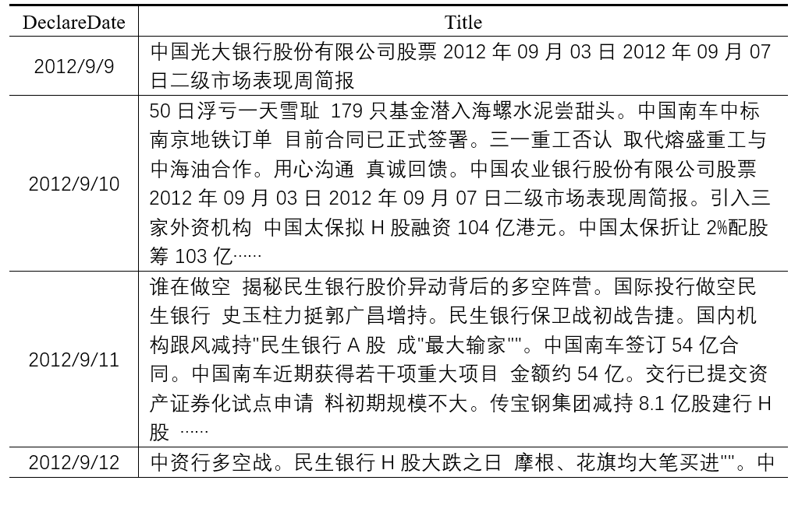

# 基于多模态多特征的证券市场股票涨跌情况预测任务

## 任务介绍

在本任务中，我们通过华为开源自研AI框架MindSpore搭建起了基于多模态多特征的深度学习模型，从图像（img）和文本（txt）两种信息载体出发，结合市场主体消息、股票价格呈现、股票技术分析等多种渠道，对证券市场股票（以上证50指数为例）的涨跌情况进行预测性分析。

## 前期工作

### 一、多模态多特征的使用情况

在以往的基于深度学习的证券市场分析中，任务的多特征输入已经成为广泛共识，包括成交量、换手率、流量、浮动等市场动向指标、Boll、kdj、rsi,macd等技术分析指标和日均线、分时均线等k线情况在内的众多证券市场股票特征都成为人们研究的基础。考虑到MindSpore框架在计算机视觉领域的深度应用和较为成熟的实践路径，我们决定采用图像-文本双模态的多特征预测分析研究。

### 二、研究对象的选取和数据集的获取情况

证券市场数据具有数据分布广、总量大、门类多的特点。为使得任务更具普适性和代表性，我们选取“上证50指数”作为研究对象，并辅以《上海证券报》中每交易日开盘前的关于上证50指数成分股的相关报道作为市场主体消息，共同组成了任务的研究对象其中，《上海证券报》中相关内容，从国泰安研究服务中心CSMAR系列数据库中整理获取。“上证50指数”中相关数据，从同花顺等证券分析交易平台获取，并经数据预处理和技术指标调整等相关工作后获得。

### 三、MindSpore框架的应用情况

为使得模型能够实现上述目标任务，我们计划运用MindSpore框架搭建起多输入、单输出的二分类模型。其中，模型输入端由两个输入部分（x,y）分别输入图像（img）和文本（txt）信息，模型输出端输出分类结果（label，涨/跌），图像部分输入（x）的处理，采用MindSpore中已经得到成熟运用的Vision Transformer（ViT）模型，文本部分的输入（y）的处理，采用时间序列领域常用的双向LSTM(Bi-lstm)模型和seq2seq结构。两部分模型分别提取两模态中信息要素，后经过模型融合，最终形成分类结果（label，涨/跌)。

## 数据情况

### 1、图像部分原始数据

通过特殊数据处理和加工手段，将证券市场动向、技术分析、价格情况等信息要素以时间为排列，构建起图像部分数据。并通过图像形式融合“上证50”的证券价格相关特征，形成模型图片部分输入内容（x）.

### 2、文本部分原始数据

通过专业财经类信息数据库（国泰安研究服务中心CSMAR系列数据库），经过相关性筛选和内容甄别，获取到《上海证券报》中每交易日开盘前的关于上证50指数成分股的相关报道，构建起文本部分数据。通过序列形式表达“上证50”证券的市场主体消息特征，形成模型文本部分输入内容（y）.

### 3、数据集生成

通过mindspore框架中[GeneratorDataset](https://www.mindspore.cn/docs/zh-CN/r1.7/api_python/dataset/mindspore.dataset.GeneratorDataset.html?highlight=generatordataset)（）方法，构建起[“img”,“txt”,“label”]的三元数据集Dataset。其中，通过自定义IMTXData类，生成关于{img,txt,label}的可迭代对象，用于GeneratorDataset（）方法中source传参。借助Dataset中map方法，实现对img列的数据预处理，将图像通道由H-W-C转变为C-H-W，并实现裁剪等图像操作。通过词典构建、词向量表示、短文本填充和长文本裁剪等文本处理手段对不定长文本进行数据预处理，并构建起文本的预训练词向量表示。

## 模型情况

借助于mindspore框架，依次完成PatchEmbedding、Attention、TransformerEncoder等Vision Transformer（ViT）模型的基础模块类，并直接使用mindspore框架中内置的LSTM。通过toger函数完成整体模型类的搭建工作，具体在construct中体现模型的多输入特性。

## 训练情况

选取二分类任务中常用的二分类交叉熵作为损失函数（[nn.BCELoss](https://www.mindspore.cn/docs/zh-CN/r1.7/api_python/nn/mindspore.nn.BCELoss.html?highlight=bceloss)），自定义MyWithLossCell类用于模型与损失的链接（net_with_loss），实现对三元数据集损失计算的适配。

采用mindspore框架的[cosine_decay_lr](https://www.mindspore.cn/docs/zh-CN/r1.7/api_python/nn/mindspore.nn.cosine_decay_lr.html?highlight=cosine_decay_lr)实现动态的学习率调整，提高训练效率和成果。采用[Adam](https://www.mindspore.cn/docs/zh-CN/r1.7/api_python/nn/mindspore.nn.Adam.html?highlight=adam)优化器。采用[TrainOneStepCell](http://www.mindspore.cn/docs/zh-CN/r1.7/api_python/nn/mindspore.nn.TrainOneStepCell.html?highlight=trainonestepcell)，用于实现单步训练。自定义train_one_epoch函数用于单步训练的梯度下降和权重更新，自定义evaluate函数用于训练情况评估，并在训练过程中更新一个“最佳损失情况”变量（best_valid_loss）用于保留最佳模型的模型参数（save_checkpoint）。

## 任务总结

尽管在任务启动前，小组就已经具备了相关任务的理论基础和实践经验，并针对mindspore框架的教学案例代码进行了细致研究,考虑到了诸如任务选择、数据集获取、模型选取、模型具体
构建、训练损失、优化等各种预想问题，但在实际任务进行过程中，仍然出现了诸如数据预处理和数据集构造、多输入模型构造融合、多输入模型与损失函数链接、多输入模型的训练等各种
未曾预想的问题，我们也尽最大努力通过查阅示例代码、阅读框架文档、理解相关源码等各种手段,并在老师和官方交流群工作人员的温馨帮助下，不断克服各种挑战，完成本次任务。在本次任务，本小组主要作出了如下工作:

- 借助华为开源自研AI框架MindSpore搭建起了基于多模态多特征的深度学习模型，以实现证券市场股票涨跌情况预测任务
- 基于MindSpore框架提出了-种多输入单输出模型的搭建思路
- 针对非业界标准格式的数据，提供了一种通过GeneratorDataset构建标准数据集 并进行适当预处理的途径，即通过自定义IMTXData类用于创建迭代对象
- 对于多输入单输出模型的损失计算问题，采用了一种通过自定义MyWithLossCe11类用于模型与损失链接的解决方式
- 采用TrainOneStepCel1完成模型训练任务,并定义train_one_epoch函数和evaluate函数用于实现单步训练的权重更新和训练情况评估以及最佳模型参数的保留

通过本次任务以及本次培训营的学习，我们在南湖畔美丽的华师校园里，正式打开了通往华为开源自研AI框架MindSpore的大门。通过框架讲解、原理学习、案例实践，任务探索等具体环节，全面认识了华为开源自研AI框架的实际意义、竞争优势、现实情况以及发展目标，系统学习了MindSpore的使用方法以及应用途径，并最终能够较为充分的运用MindSpore框架解决研
究、开发等工作过程中的需求和问题。与华中其他兄弟学校的积极讨论，也加深了我们对深度学习领域在模型、训练、应用等各个方面的理解，很好的拓宽了下一步的工作思路。gitee中
mindspore公共仓的一些玩法和我们的亲身贡献，也让我们眼前一亮,不同于以往熟悉而又充满着距离感的深度学习框架，mindspore竟离我们如此之近。

总而言之，" mindspore is all you need , huawei is all you need ! ".

