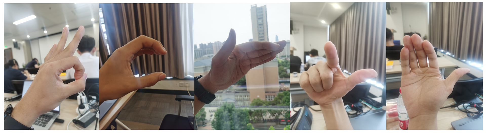

# Mindspore之手势识别检测-实验日志文档

深度学习技术的发展极大的促进了生产力的提升，智能家务、智能办公等技术景象都在这一轮的技术发展浪潮中成为可能。这其中，手势识别作为一种全新的人机交互模式，在多种场景中都有应用，具有极其重要的作用。本实验探究如何将深度学习技术应用到手势识别之中

## 训练参数列表

| Parameter | Vit |ResNet18| SE-Conv |
|-----|---------|--------|---------|
|epoch_size| 80 |120|120|
|learning_rate| 0.0001  |0.0002|0.0002|
|optimizer|Adam|Adam|Adam|
|loss_fn| CrossEntropySmooth(reduction="mean", smooth_factor=0.1,classes_num=num_classes)   |SoftmaxCrossEntropyWithLogits(sparse=True, reduction='mean')|CrossEntropySmooth(reduction="mean",smooth_factor=0.05,classes_num=num_classes)|

## 多任务结果对比

在实验过程中，我们遇到了诸多问题，例如模型不学习、不收敛，以及ViT的训练效果远远不如CNN等。为了辅助这些问题的解决，我们额外进行了一个手势识别任务，该任务使用的一个四分类的手势识别数据集(下载地址：<https://www.kaggle.com/datasets/abdullahalrowais/hand-gestures-datasets>)。

我们的模型在四分类数据集和十分类数据集上的表现如下：

|Task|ResNet18|Vit|SE-Conv|
|----|--------|-----|----|
|四分类手势|  /  | 0.480  | 0.95  |
|十分类手势| 0.997   | 0.160  | 0.967  |

## 遇到的问题与解决方案

### (1) 模型不收敛/不学习

在十分类任务的训练过程中，我们的模型准确率总是收敛到0.1。对于一个10分类问
题而言，这种现象意味着模型没有进行学习，而是重复的给出一个值。

```python
模型不收敛/不学习时的训练结果
--------------------
Epoch: [  1 /  10], Train Loss: [1.647], Accuracy:  0.313
epoch time: 962548.398 ms, per step time: 6875.346 ms
--------------------
Epoch: [  2 /  10], Train Loss: [11.963], Accuracy:  0.100
epoch time: 411056.031 ms, per step time: 2936.115 ms
```

```python
正常时的训练结果
--------------------
Epoch: [  1 /  10], Train Loss: [1.394], Accuracy:  0.120
epoch time: 64630.198 ms, per step time: 726.182 ms
--------------------
Epoch: [  2 /  10], Train Loss: [0.417], Accuracy:  0.880
epoch time: 62469.246 ms, per step time: 701.902 ms
```

解决这个问题的方式是使用控制变量法进行实验，我们控制的变量包括：学习率、动量大小、优化器、损失函数。为了尽快排查出故障原因，我们首先在四分类数据集上进行实验，在发现问题所在并改正之后，再将模型在十分类训练集上进行训练。

对于动量，我们推测，由于动量优化器在t时刻的下降方向，不仅由当前点的梯度方向决定，而且由此前累积的下降方向决定，这就意味着下降方向主要是此前累积的下降方向，并略微偏向当前时刻的下降方向。由于训练数据数量较为均衡且差异不大，每次学习学到的知识不多，并且很可能在下一次学习中遗忘，最终导致了没有产生学习效果。对于优化器的推断与上述类似。

对于学习率，我们推断有两种可能。一种可能是学习率过小，导致模型无被困在局部的“盆地”，从而无法学习新的知识。另一种可能是学习率过大，导致模型单步跨越距离过长，无法向损失函数的“谷底”前进。

我们首先将模型全部迁移到四分类数据集上，问题的突破口在于我们发现ViT模型在四分类数据集上有一定的收敛，但在达到40%的准确率后开始剧烈的振动(在20%到50%之间)，这向我们揭示了问题的关键很有可能在于学习率过大。因此，我们将原先的学习率集体缩小，同时将动量、损失函数的光滑系数也进行一定程度的缩小，并再次进行训练，发现问题得到了解决。

为了确定问题的确是由于学习率过大所致，我们还额外进行了控制变量实验进行验证。我们选用SE-Conv模型模型和十分类数据集进行实验，并对学习率、动量与光滑系数进行单步修改，结果显示，对动量与光滑系数的修改并不能改变模型不收敛的情况，而缩小学习率后该情况则得到了明显改善。这再一次验证了模型不收敛/不学习问题是由于学习率过大导致的。

### (2) ViT效果远不如CNN

ViT的提出时间远远晚于CNN，并且在多个任务的表现上都要胜过CNN。因此，在本实验中ViT的训练效果远不如CNN是违反直觉的。为了确保该结论的正确性，我们进行了详细的验证。

第一，除了尝试调整超参数外，我们对ViT模型的结构也进行了反复的测试。具体而言，尝试的集合包括：layer_nums=[2,3,6]，num_head=[4,8,12]，emb_dim=[364,512,768]。即使经过这些尝试，ViT的表现仍旧远远不如CNN网络。

第二，除了该实验原先的十分类问题外，我们额外在新的四分类问题上对比了CNN和ViT的表现。结果显示，虽然ViT在四分类问题上的表现要明显好于十分类，但其表现与CNN相比仍有极大的差距。

综上所述，我们基本确定了在手势识别任务上，CNN的表现是要优于ViT的。我们推测，这主要是由于手势识别任务更关注局部的轮廓信息，而这正是CNN所擅长的内容。与此相反，Transformer结构则更关注各个Patch之间的结构关联，即全局的结构信息，这与手势识别的模式重点不符合，因此更难取得较好的效果。我们猜想，可以通过进一步实现MobileViT并测试来验证上述推测的正确性。MobileViT是ViT与CNN的结合品，因此如果其表现处于CNN与ViT之间，那么上述推测就大概率是正确的。

## 模型训练过程

部分仍有保留的结果如下所示，其余结果读者可以自行训练从而补全。

ResNet18网络训练结果

```python
Epoch: [ 117 /  120], Train Loss: [0.000], Accuracy:  1.000
epoch time: 46975.496 ms, per step time: 1739.833 ms
--------------------
Epoch: [ 118 /  120], Train Loss: [0.001], Accuracy:  1.000
epoch time: 47817.063 ms, per step time: 1771.002 ms
--------------------
Epoch: [ 119 /  120], Train Loss: [0.003], Accuracy:  1.000
epoch time: 49969.149 ms, per step time: 1850.709 ms
--------------------
Epoch: [ 120 /  120], Train Loss: [0.000], Accuracy:  0.979
```

## 模型测试过程

SENet网络测试代码

```python
test_path = "handgesture_datasets_mini\\test"
dataset_test = create_dataset(test_path,batch_size=1,train=False,image_size=50,class_indexing=class_index)
eval_metrics = {'Top_1_Accuracy': nn.Top1CategoricalAccuracy()}
model = ms.Model(se_conv, network_loss, metrics=eval_metrics)
result = model.eval(dataset_test)
print(result)
```

SENet网络测试结果

```python
{'Top_1_Accuracy': 0.9666666666666667}
```

ResNet18网络测试代码

```python
test_path = "handgesture_datasets_mini\\test"
dataset_test = create_dataset(test_path,batch_size=1,train=False,image_size=50,class_indexing=class_index)
eval_metrics = {'Top_1_Accuracy': nn.Top1CategoricalAccuracy()}
model = ms.Model(resnet18, network_loss, metrics=eval_metrics)
result = model.eval(dataset_test)
```

ResNet18网络测试结果

```python
{'Top_1_Accuracy': 0.9966666666666667}
```

## 模型推测




我们的模型可以正确预测图1，2，4，5。将图3的palm_moved预测为ok。
