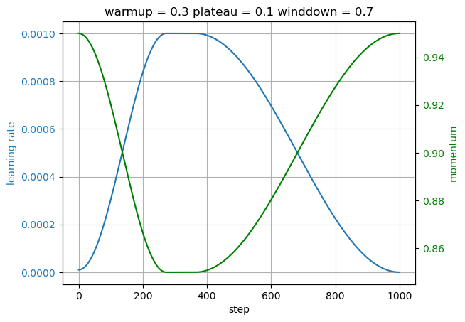

# A disciplined approach to neural network hyper-parameters: Part 1 -- learning rate, batch size, momentum, and weight decay

## Overview

This project migrates the PyTorch implementation of the paper *A Disciplined Approach to Neural Network Hyper-Parameters: Part 1 -- learning rate, batch size, momentum, and weight decay* to the MindSpore framework. It provides tools for efficiently tuning hyper-parameters such as learning rate, batch size, momentum, and weight decay.

## Run

```bash
python main.py
```

## Output



## References

- Paper: [A Disciplined Approach to Neural Network Hyper-Parameters: Part 1](https://paperswithcode.com/paper/a-disciplined-approach-to-neural-network)
- Original Code: [PyTorch Implementation](https://github.com/csvance/onecycle-cosine)