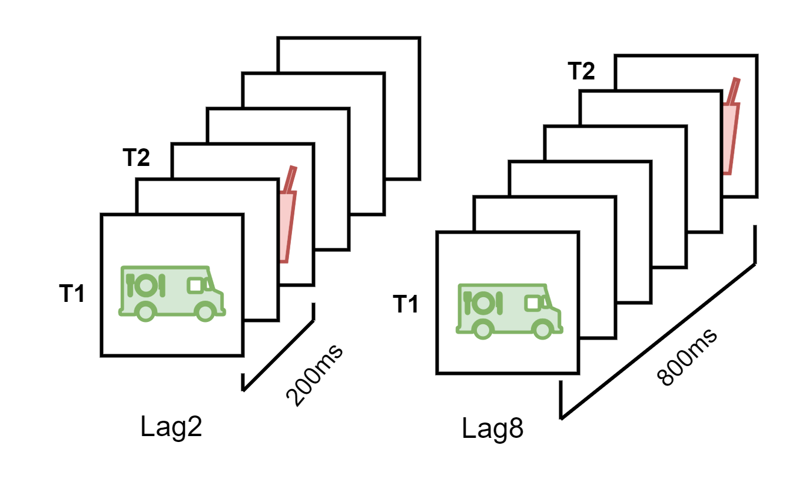
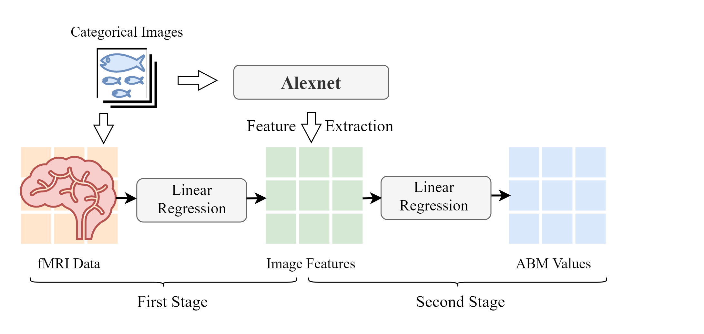
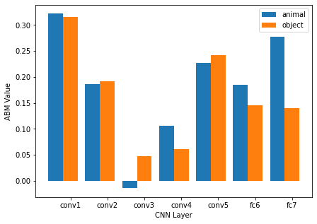
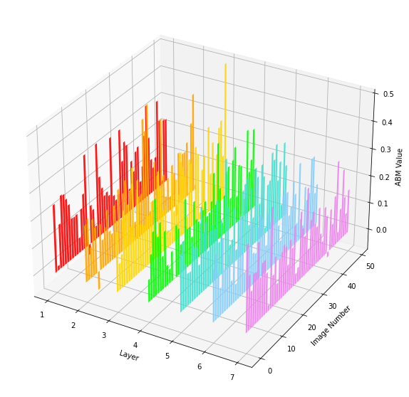

# Alexnet-ABeffect

Alexnet-ABeffect is an application of Alexnet realized by Mindspore in exploring the mechanisms of attentional blink (AB) effect, as demonstrated in our paper,[Categorical Difference and Related Brain Regions of the Attentional Blink Effect, PIERS 2021](https://arxiv.org/abs/2111.02044)

The Alextnet model is based on [Mindspore official Alexnet model](https://gitee.com/mindspore/models/tree/master/official/cv/alexnet).

## Abstract

Attentional blink (AB) is a biological effect, showing that for 200 to 500 ms after paying attention to one visual target, it is difficult to notice another target that appears next, and attentional blink magnitude (ABM) is a indicating parameter to measure the degree of this effect.



Researchers have shown that different categories of images can access the consciousness of human mind differently, and produce different ranges of ABM values. So in this paper, we compare two different types of images, categorized as animal and object, by predicting ABM values directly from image features extracted from Alextnet, and indirectly from functional magnetic resonance imaging (fMRI) data.



First, for two sets of images, we separately extract their average features from layers of Alexnet, a classic model of CNN, then input the features into a trained linear regression model to predict ABM values, and we find higher-level instead of lower-level image features determine the categorical difference in AB effect, and midlevel image features predict ABM values more correctly than low-level and high-level image features.
Then we employ fMRI data from different brain regions collected when the subjects viewed 50 test images to predict ABM values, and conclude that brain regions covering relatively broader areas, like LVC, HVC and VC, perform better than other smaller brain regions, which means AB effect is more related to synthetic impact of several visual brain regions than only one particular visual regions.

## Dependencies

- Python == 3.7.5
- MindSpore: https://www.mindspore.cn/install
- numpy
- pandas
- matplotlib
- cv2
- ModelArts：https://console.huaweicloud.com/modelarts/?region=cn-north-4#/dashboard

## Pretrain the model

The Alexnet model was pretrained on HuaweiCloud ModelArts on CIFAR-10 dataset following the tutorial of [Mindspore official Alexnet model](https://gitee.com/mindspore/models/tree/master/official/cv/alexnet).

## Feature extraction

-alexnet_feature_extraction.py

This script is for extracting image features respectively from 7 layers of the pretrained Alexnet(except the output layer).

The images in use are provided by [Horikawa T](https://www.nature.com/articles/ncomms15037?origin=ppub) and [Daniel Lindh](https://www.nature.com/articles/s41467-019-12135-3),  we are very grateful for their generous help.

## ABM prediction

-feature_predict_abm.py

This script is for predicting ABM from extracted image features and predicted image features by fMRI data using a trained linear regression model based on the paper [Conscious perception of natural images is constrained by category-related visual features](https://www.nature.com/articles/s41467-019-12135-3).

The predicted image features by fMRI data are generated based on the paper [Generic decoding of seen and imagined objects using hierarchical visual features](https://www.nature.com/articles/ncomms15037?origin=ppub).

All image features predicted by fMRI data are uploaded on this [figshare project](https://figshare.com/articles/dataset/Alexnet-ABeffect_predicted_image_features_from_fMRI_data/16960732).

## Results





## Citation

Please kindly cite the references in your publications if it helps your research:

```
@INPROCEEDINGS{9695056,
  author={Gui, Renzhou and Ji, Xiaohong},
  booktitle={2021 Photonics   Electromagnetics Research Symposium (PIERS)},
  title={Categorical Difference and Related Brain Regions of the Attentional Blink Effect},
  year={2021},
  volume={},
  number={},
  pages={348-353},
  doi={10.1109/PIERS53385.2021.9695056}}
