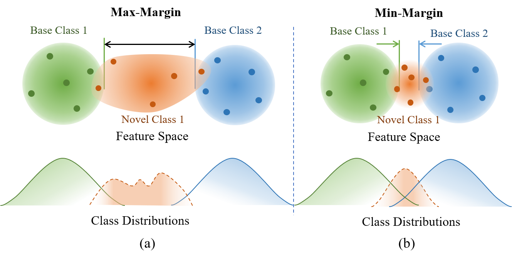
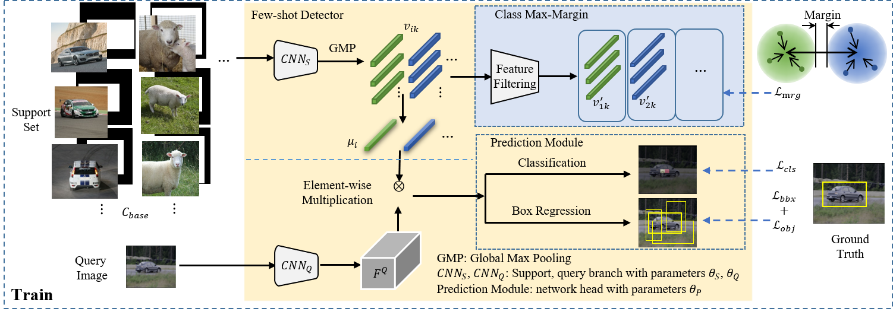
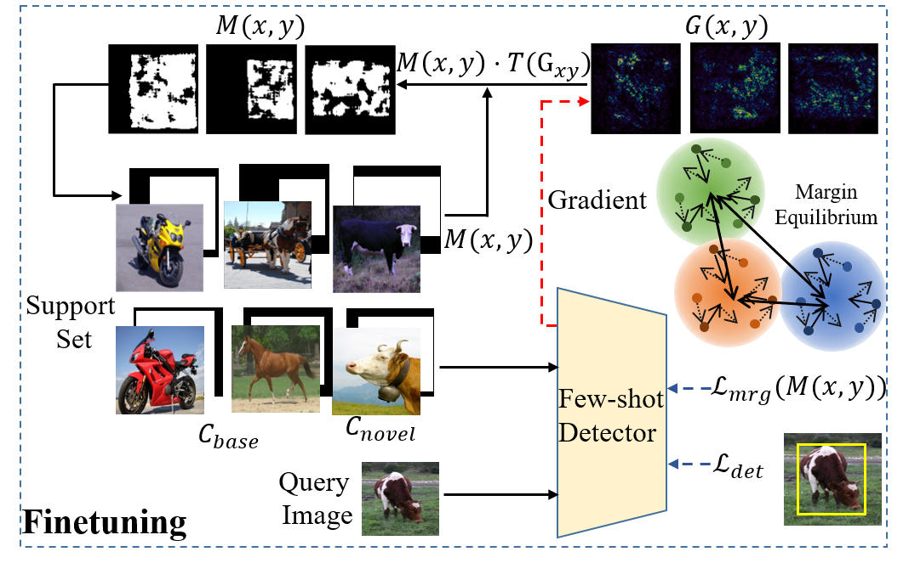

# Beyond Max-Margin: Class Margin Equilibrium for Few-shot Object Detection

This repository is built upon [Meta YOLO](https://github.com/bingykang/Fewshot_Detection)

# Introduction

This is the officical of [Beyond Max-Margin: Class Margin Equilibrium for Few-shot Object Detection](https://arxiv.org/pdf/2103.04612.pdf).

Few-shot object detection has made substantial progress by representing novel class objects using the feature representation learned upon a set of base class objects.
However, an implicit contradiction between novel class classification and representation is unfortunately ignored.
On the one hand, to achieve accurate novel class classification, the distributions of either two base classes must be far away from each other (max-margin).
On the other hand, to precisely represent novel classes, the distributions of base classes should be close to each other to reduce the intra-class distance of novel classes (min-margin).
In this paper, we propose a class margin equilibrium (CME) approach, with the aim to optimize both feature space partition and novel class reconstruction in a systematic way.
CME first converts the few-shot detection problem to the few-shot classification problem by using a fully connected layer to decouple localization features.
CME then reserves adequate margin space for novel classes by introducing simple-yet-effective class margin loss during feature learning.
Finally, CME pursues margin equilibrium by disturbing the features of novel class instances in an adversarial min-max fashion.
Experiments on Pascal VOC and MS-COCO datasets show that CME significantly improves upon two baseline detectors (up to 3 ~ 5% in average), achieving state-of-the-art performance.

The contradiction of representation and classification in few-shot object detection is shown as following:



In this work, we propose a class margin equilibrium(CME) approach, with the aim to optimize feature space partition for few-shot object detection with adversarial class margin regularization.
For the object detection task, CME first introduces a fully connected layer to decouple localization features which could mislead class margins in the feature space.
CME then pursues a margin equilibrium to comprise representation learning and feature reconstruction.
Specifically, during base training, CME constructs a feature space where the margins between novel classes are maximized by introducing class margin loss.

The framework is shown as following:



During network finetuning, CME introduces a feature disturbance module by truncating gradient maps.
With multiple training iterations, class margins are regularized in an adversarial min-max fashion towards margin equilibrium, which facilities both feature reconstruction and object classification in the same feature space.

The network with feature disturbance is shown as following:



# Citing

```cite
@InProceedings{Li_2021_CVPR,
  author = {Bohao Li, Boyu Yang, Chang Liu, Feng Liu, Rongrong Ji and Qixiang Ye},
  title = {Beyond Max-Margin: Class Margin Equilibrium for Few-shot Object Detection},
  booktitle = {IEEE/CVF Conference on Computer Vision and Pattern Recognition (CVPR)},
  month = {June},
  year = {2021}
}
```
