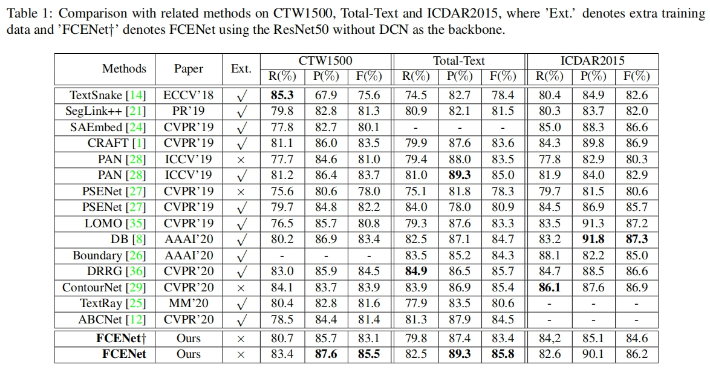

# ***FourierText***

 This is the code for FCENet in mindspore platform. '[Fourier Contours Embedding for Arbitrary-Shaped Text Detection]()'

 FCE(fourier contours embedding) has two major advantages:

 1. it can represent text of any shape;
 2. it can be easily implemented on other networks.


## ***Requirements***

* Ubuntu 18.04
* cuda 10.2
* python 3.7
* mindspore 1.3
* opencv 4.2

## ***Performance***

 This detector achieves SOTA performance on two arbitrary-shaped dataset, which are [SCUT-CTW1500 dataset](https://github.com/Yuliang-Liu/Curve-Text-Detector)
 and [Total-Text dataset](https://github.com/cs-chan/Total-Text-Dataset)
 and [ICDAR2015 dataset](https://rrc.cvc.uab.es/).



## ***Perpare***

1. create an environment and install the required packages step by step.
2. put the dataset in `data` fold:

```bash
 --> data
 ----> ctw1500
 ----> total-text-mat
 ----> icdar2015
```

3. put the model in `model` fold:

## ***Evaluate***

```bash
# evaluate ctw1500
python eval_FourierText.py --tr_thresh 0.75 --nms_thresh 0.1 --test_size 640 1280 --exp_name Ctw1500 --resume model/model_for_ctw1500.ckpt

# evaluate total-text
python eval_FourierText.py --tr_thresh 0.9 --nms_thresh 0.2 --test_size 960 1280 --exp_name Totaltext --resume model/model_for_totaltext.ckpt

# evaluate icdar2015
python eval_FourierText.py --tr_thresh 0.9 --nms_thresh 0.1 --test_size 640 1280 --exp_name Icdar2015 --resume model/model_for_icdar2015.ckpt
```

## ***Citation***

If you find this code is useful, please cite

