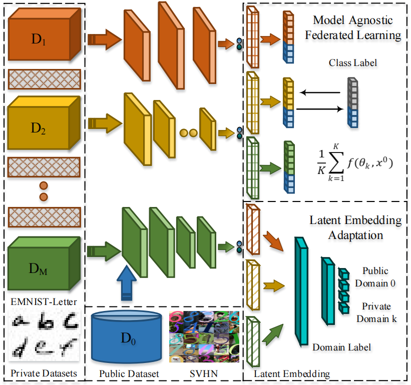

# ACM International Conference on Multimedia

This is the MindSpore implementation of FSMAFL in the following paper.

Wenke Huang, Mang Ye, Xiang Gao, Bo Du. Few-Shot Model Agnostic Federated Learning, in ACM MM, 2022.

# [FSMAFL Description](#contents)

FSMAFL(Few-Shot Model Agnostic Federated Learning) is a latent embedding adaptation framework that can address the large domain gap between the public and private datasets in federated learning process. It is based on two parts:

1. Latent embedding adaptation confuses domain classifier to reduce the impact of domain gap.

2. Model agnostic federated learning is responsible for public-private communication. The public dataset acts as the bridge for model communication and private dataset is used for avoiding forgetting.

# [Framework Architecture](#contents)



# [Dataset](#contents)

Our experiments are conducted on two datasets, MNIST and EMNIST-Letter. The public dataset on the server is set to MNIST. and the private dataset on the client is set to EMNIST-Letter.

Note: Data will be processed in data_init.py

# [Environment Requirements](#contents)

Hardware

- Support Ascend environment.
- Ascend: Ascend 910.

Framework

- [MindSpore](https://gitee.com/mindspore/mindspore)

For more information, please check the resources below：

- [MindSpore Tutorials](https://www.mindspore.cn/tutorials/en/master/index.html)
- [MindSpore Python API](https://www.mindspore.cn/docs/api/en/master/index.html)

# [Quick Start](#contents)

After installing MindSpore via the official website, you can start training and evaluation as follows:

```bash
# Initialize the local models
python model_initialization.py
# FSMAFL
python Communication_GAN.py
```

# [Script Description](#contents)

## [Script and Sample Code](#contents)

```bash
├── FSMAFL
    ├── Dataset
        ├── MNIST
            ├── test
                ├── t10k-images-idx3-ubyte
                ├── t10k-labels-idx1-ubyte
            ├── train
                ├── train-images-idx3-ubyte
                ├── train-labels-idx1-ubyte
        ├── emnist-letters
    ├── Temp
        ├── priv_data_72.npy
        ├── total_priv_data_72.pickle
    ├── collabporate_train.py
    ├── Communication_GAN.py
    ├── data_utils.py
    ├── model_initialization.py
    ├── model_utils.py
    ├── models.py
    ├── option.py
    ├── README.md
```

# [Model Description](#contents)

## [Performance](#contents)

### Evaluation Performance

The experimental setting is slightly different from the original paper due to different platforms. In the heterogeneous model scenario, we assign five different networks in models.py. The accuracy(%) is based on the EMNIST-Letter dataset. Initial represents only do initialization without federated learning process.

|         | θ1    | θ2    | θ3    | θ4    | θ5    | Avg   |
| ------- | ----- | ----- | ----- | ----- | ----- | ----- |
| Initial | 20.16 | 26.37 | 45.02 | 41.04 | 42.33 | 34.98 |
| FSMAFL  | 23.67 | 30.31 | 47.08 | 43.92 | 47.25 | 38.45 |

# [Citation](#contents)

```citation
@inproceedings{huang2022fewshot,
  title={Few-Shot Model Agnostic Federated Learning},
  author={Huang, Wenke and Ye, Mang and Gao, Xiang and Du, Bo},
  booktitle={ACM MM Industry Track},
  year={2022}
}
```
