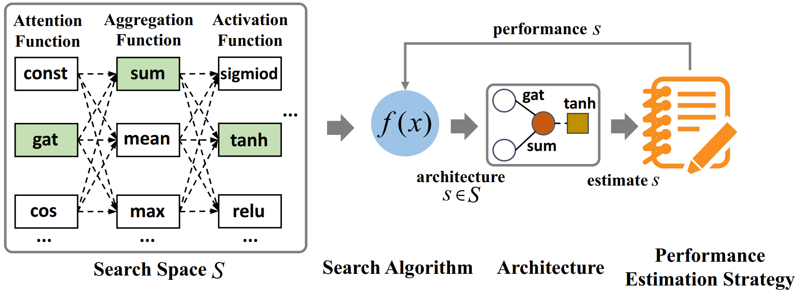
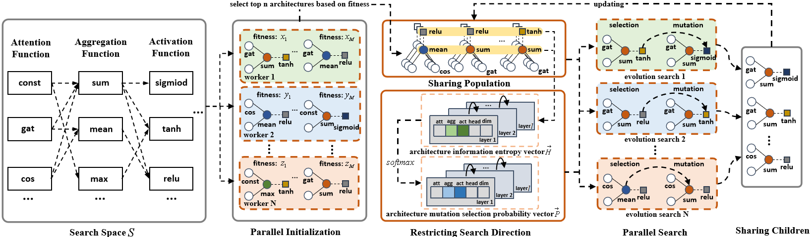

## Graph Neural Network Parallel Architecture Search
---
### 一.图神经网络结构搜索

#### 1.图神经网络结构搜索定义:

1. 如图1GraphNAS所示，在相应的图神经网络结构搜索空间，使用搜索算法搜索图神经网络参数;
2. 基于图神经网络参数结构参数按照固定图神经网络构型(消息传递网络）进行建模;
3. 使用图神经网络结构参数评估策略(节点分类验证集准确度)进行结构参数评估；
4. 将评估信号反馈给搜索算法;
5. 搜索算法基于反馈信号指导下一步结构搜索动作;

#### 2.图神经网络结构参数定义:

1. 五个参数组成一层图神经网络结构，每层结构组件组合顺序一致顺序如2;
2. (1).注意力机制函数－>(2).节点聚合函数－>(3).激活函数－>(4).多头注意力机制头数－>(5).输出层隐层单元维度;
3. 结构参数表示如下,n表示图神经网络层数:
        [att(1),agg(1),act(1),head(1),dim(1),...,att(n),agg(n),act(n),head(n),dim(n)]；

图1.GraphNAS

#### 3单层图神经网络构型定义(消息传递网络构型)：
   
    节点特征矩阵－>dropout层－>head个dim特征降维层－>attention层(head个独立attention参数)－>
    
    －>节点聚合层－>特征向量拼接(最后一层GNN操作：加和平均)层－>激活函数层－>节点特征矩阵
---
### 二.并行进化搜索算法架构图(GraphPAS Framework)

#### 1.搜索算法核心:
1. 并行化搜索;
2. 使用图神经网络结构组件分布约束遗传搜索方向;
  

图2.GraphPAS Framework

---

### 三.安装

1. **python库**

    - python >= 3.6
    - scipy==1.1.0
    - torch==1.1.0
    - torch_scatter==1.2.0
    - torch-cluster==1.4.0
    - torch-sparse==0.4.0
    - torch_geometric==1.2.1
    - numpy==1.15.4
    - scikit_learn==0.21.3
    - ray==1.2.0
    - requests

2. **cuda版本9.0**

---
### 四.项目目录结构：

                    graphpas
                        |－－－build_gnn        :图神经网络构建
                                 |－－－ __init__.py
                                 |－－－ gnn_manager.py          :图神经网络建模管理 
                                 |－－－ gnn_net.py　　　         :图神经网络前向计算
                                 |－－－ graph_sample.py         :图数据随机采样
                                 |－－－ message_passing_net.py  :消息传递网络/参数初始化   
                                 |
                   		 |
                          graphpas_search      :GraphPAS并行遗传搜索
                                 |－－－ __init__.py
                                 |－－－ search_algorithm.py     :并行搜索算法
                                 |－－－ search_manager.py       :搜索算法管理
                                 |－－－ util.py                 :数据处理/存储/读取
                             __init__.py
                                 |
                        device_information.py    :GPU硬件判断
                                 |
                            estimation.py        :GNN结构参数评估
                                 |
                         parallel_operator.py    :平行计算
                                 |
                                 search_space.py :GNN结构搜索空间/GNN构型
                     data_util
                        |－－－ cite_network          :cite_network数据集合
                        |－－－ util_cite_network.py  :cite_network数据集预处理

                     examples
                        |－－－ graph_data_bulid_example     :图数据构建案例
                        |                |－－－ graph_data_build.py     :自定义图数据构建
                        |                |－－－ node_edge.txt           :图边关系文件
                        |                |－－－ node_feature.txt        :图节点特征文件
                        |                |－－－ node_label.txt          :图节点标签文件 
                        |－－－graph_data_sample_example     :图数据随机采样案例
                        |                |－－－ graph_data_sample.py    :图随机采样
                        |－－－ node_classification_example  :节点分类案例
                                         |－－－ node_classification.py  :节点分类
                                         
                   parallel_config.py    :并行机制初始化
---
### 五.使用案例

#### 案例 1.构建自己的图数据集

- 图数据构建:
        
        案例脚本:
        examples/graph_data_build_example/graph_data_build.py
        
- 图数据格式:
        
        案例文件:
        1.examples/graph_data_build_example/node_edge.txt
        2.examples/graph_data_build_example/node_feature.txt
        3.examples/graph_data_build_example/node_label.txt

#### 案例 2.对自定义图数据随机采样

- 图数据随机采样:

        案例脚本：
        examples/graph_data_sample_example/graph_data_sample.py 

#### 案例 3.基于cite_network图数据的节点分类    

- Transductive Learning节点分类案例:

        案例脚本：
        examples/node_classification_example/node_classification.py

#### 案例 4.并行启动与机制

- 并行启动:

        from parallel_config  import ParallelConfig
        ParallelConfig(True)  # True 并行

- 串行调试:

        from parallel_config  import ParallelConfig
        ParallelConfig(False)  # Fasle 串行

- GPU/CPU资源使用/机制

        1.自动识别主机GPU/CPU资源.
        2.自动默认使用主机全部GPU资源,当没有GPU资源默认使用主机CPU所有逻辑核心资源.
        3.优先使用GPU资源.      
---
