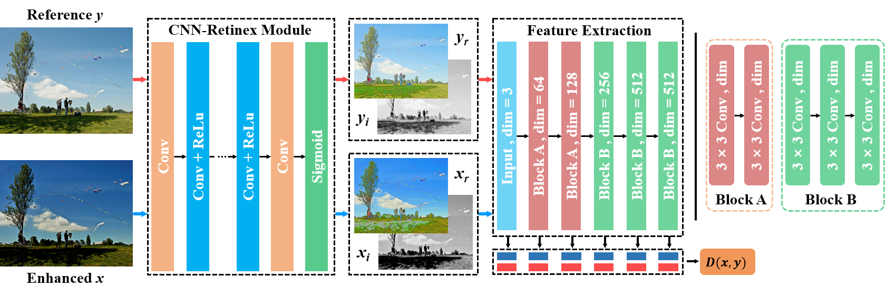
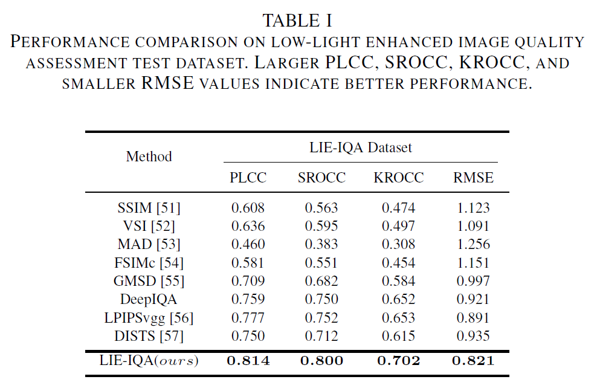
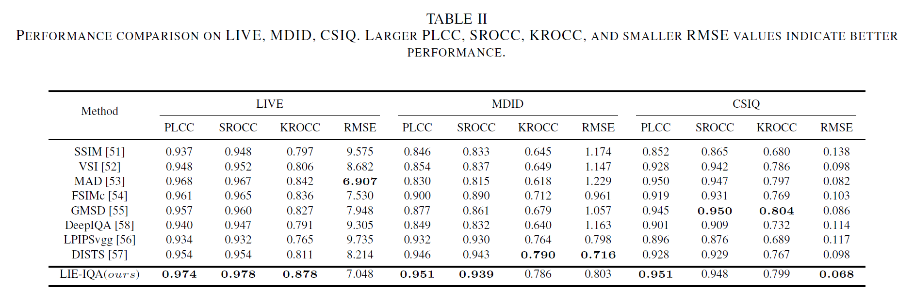
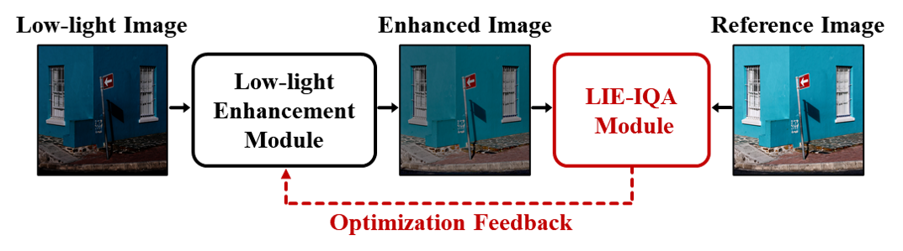

# LIE-IQA

The [MindSpore](https://www.mindspore.cn/) implementation of LIE-IQA.

You can get [Pytorch](https://pytorch.org/) the implementation here [LIE-IQA-pytorch](https://github.com/yiumac/LIE-IQA). It is worth noting that the MindSpore implementation of Image Intrinsic Decomposition (IID) Module is different from the Pytorch implementation , but there is not much difference in performance. Please refer to the specific code for details.

## Requirements

+ Python 3.7.5
+ MindSpore 1.2.1
+ CUDA 10.1

## Quality Assessment for Enhanced Low-light Image

+ LIE-IQA Framework

  

+ Performance on LIE-IQA Dataset

  

+ Performance on General Scene IQA Dataset (LIVE, MDID, CSIQ)

  

## Quality Optimization for Low-light Image Enhancement

+ Optimization framework

  

## Predict

+ download the checkpoint from [Baidu Drive](https://pan.baidu.com/s/1oqE7VQHpmtfyjMuTQqeTfw) (ae9a)

```bash
# download the checkpoint
# run LIEIQA_predict.py
python LIEIQA_predict.py
```
