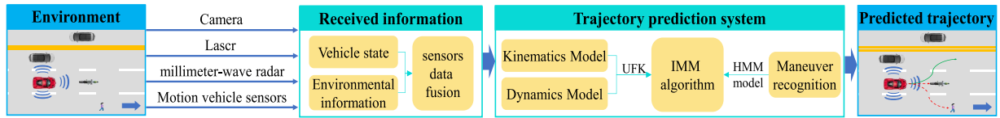

# An Interacting Multiple Model for Trajectory Prediction of Intelligent Vehicles in Typical Road Traffic Scenario

This repository is built upon [UKF](https://gitee.com/ustcdeveloper/contrib)

## Introduction

This is an implement of Unscented Kalman Filter(UKF) based on Mindspore, which is a basic algorithm for IMM in origin paper: [An Interacting Multiple Model for Trajectory Prediction of Intelligent Vehicles in Typical Road Traffic Scenario](https://pubmed.ncbi.nlm.nih.gov/34971543/).

This article presents an interacting multiple model (IMM) for short-term prediction and long-term trajectory prediction of an intelligent vehicle. This model is based on vehicle's physics model and maneuver recognition model. The long-term trajectory prediction is challenging due to the dynamical nature of the system and large uncertainties. The vehicle physics model is composed of kinematics and dynamics models, which could guarantee the accuracy of short-term prediction. The maneuver recognition model is realized by means of hidden Markov model, which could guarantee the accuracy of long-term prediction, and an IMM is adopted to guarantee the accuracy of both short-term prediction and long-term prediction. The experiment results of a real vehicle are presented to show the effectiveness of the prediction method.

The system proposed in our paper is consisted of three main subsections: environment description, information processing and trajectiory prediction. The architecture of our work can be concluded from the picture below:



In this article, we propose the IMM algorithm to achieve a long-term trajectory prediction with high accuracy for intelligent vehicles. It is not only of practical interests but also academic challenges. The designed method contains three parts, namely, vehicle physics model-based method, maneuver
recognition-based method, and IMM algorithm. The vehicle physics model-based method is suitable for a short-term prediction, while the maneuver recognition-based method can predict trajectory in a long term. Importantly, the uncertain factors for trajectory prediction in designed procedures are considered, such as the noisy information, modeling error, and different driving maneuvers, which makes the prediction results more practical and reasonable. The experimental results show that in comparison with using a single method, the developed IMM method integrating the advantages of both predicting methods is deterministic and capable of anticipating high accuracy trajectory in a longer horizon.

The comparison of accuracy among our method and other similar algorithms can be described as below:


## Environment

In this project, we adopt:

- Python 3.7.5
- Mindspore-gpu 1.0.1

Refer to [MindSpore Installation Guide](https://www.mindspore.cn/install/en) for details.

## Usage

1. Download necessary independences:

```shell
conda install numpy, conda install pyplot, conda install mindspore-gpu=1.0.1 -c mindspore -c conda-forge
```

2. Run the `ukf.py` script

```shell
python ukf.py
```

## Todo

The code of IMM and necessary dependencies will be uploaded soon.